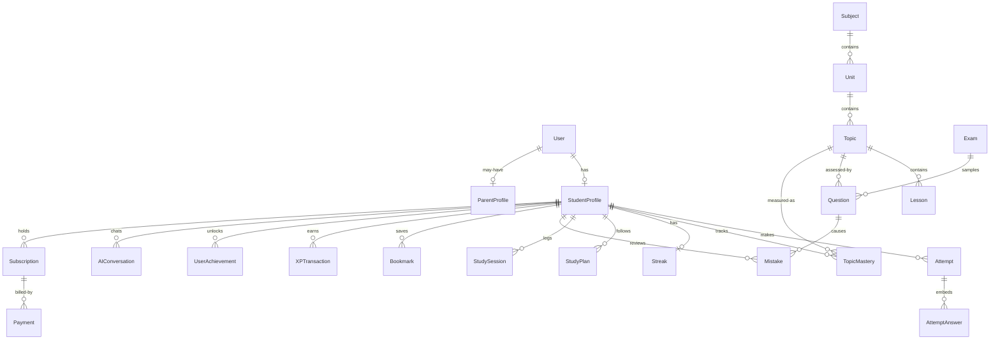
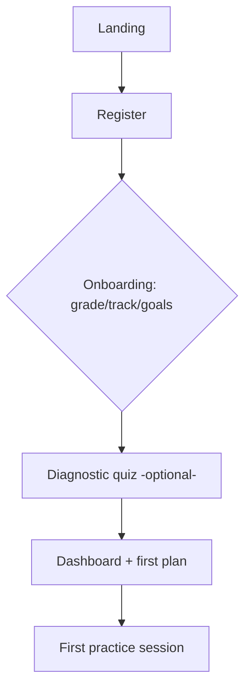
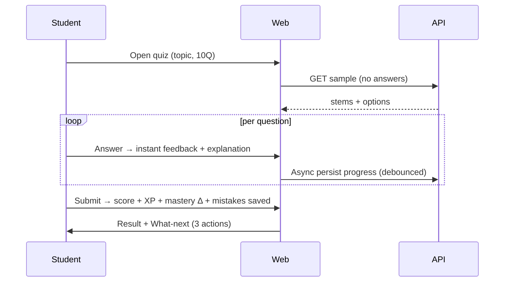
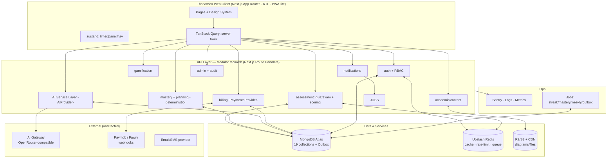

# ثانويكو — Thanawico
## Personal Learning OS for Egyptian Secondary-School Students
### Master Product & Technical Blueprint — Single Source of Truth

> **Status:** Pre-implementation blueprint (v1.0). Do NOT implement until this document is approved.
> **Audience:** Senior developers + AI coding agents building the platform.
> **Rule:** If this README conflicts with any other doc, chat message, or assumption — **this README wins**.
> **Language strategy:** Product UI is **Arabic-first, RTL-first**. This blueprint is written in English for engineering precision, with Arabic names where student-facing.

---

## Table of Contents

1. [Product Overview](#1-product-overview)
2. [Brand Identity & Logo Direction](#2-brand-identity--logo-direction)
3. [Business Model](#3-business-model)
4. [Business Logic](#4-business-logic)
5. [User Roles](#5-user-roles)
6. [Feature Map](#6-feature-map)
7. [AI Architecture](#7-ai-architecture)
8. [UX Architecture](#8-ux-architecture)
9. [UI System](#9-ui-system)
10. [Responsive Design](#10-responsive-design)
11. [Database Architecture](#11-database-architecture)
12. [Database Relationship Map](#12-database-relationship-map)
13. [System Architecture](#13-system-architecture)
14. [Project Structure](#14-project-structure)
15. [API Architecture](#15-api-architecture)
16. [Security Architecture](#16-security-architecture)
17. [Performance Architecture](#17-performance-architecture)
18. [Observability](#18-observability)
19. [Analytics](#19-analytics)
20. [Content Architecture](#20-content-architecture)
21. [Question Engine](#21-question-engine)
22. [Exam Engine](#22-exam-engine)
23. [Gamification](#23-gamification)
24. [Study Plan Engine](#24-study-plan-engine)
25. [User Flows](#25-user-flows)
26. [Route Architecture](#26-route-architecture)
27. [MVP Definition](#27-mvp-definition)
28. [MVP Roadmap](#28-mvp-roadmap)
29. [Development Roadmap](#29-development-roadmap)
30. [Testing Strategy](#30-testing-strategy)
31. [DevOps](#31-devops)
32. [Technical Decision Records](#32-technical-decision-records)
33. [Product Risks](#33-product-risks)
34. [Non-Goals](#34-non-goals)
35. [Future Architecture](#35-future-architecture)
36. [Master Architecture Diagram](#36-master-architecture-diagram)
37. [Assumptions Register](#37-assumptions-register)
38. [Glossary](#38-glossary)

---

## 1. Product Overview

### 1.1 Vision

> Every Egyptian secondary student knows exactly **what to study next, why, and whether it is working** — regardless of school quality, private tutoring access, or governorate.

### 1.2 Mission

Build a **Personal Learning OS** that closes the loop between **learning → practice → assessment → diagnosis → planning → improvement**, in Arabic, mobile-first, aligned to the Egyptian curriculum.

### 1.3 Problem

**Core problem:** Egyptian Thanaweya Amma students (esp. الصف الثالث الثانوي) drown in content (videos, PDFs, private lessons/دروس خصوصية) but have **no reliable system to answer**: *What am I weak at? Why did I fail this question? What should I do today? Am I actually improving?*

**Secondary problems:**

| # | Problem | Evidence / Rationale (assumption to validate) |
|---|---------|-----------------------------------------------|
| P1 | Fragmented sources, no single progress view | Students use 4–7 sources (YouTube, مذكرات, سناتر). No unified tracking. |
| P2 | Passive learning (watching ≠ understanding) | Video completion is mistaken for mastery. |
| P3 | Mistakes are repeated, not understood | No mistake-review loop; same concept fails repeatedly. |
| P4 | Generic schedules, not personal plans | Fixed timetables ignore individual weaknesses and time available. |
| P5 | Exam anxiety + no realistic benchmarking | Few full timed mock exams with analysis. |
| P6 | Motivation collapse over long year | Year-long grind with delayed reward (final exam). Needs short-term feedback. |
| P7 | Inequality of access | Quality tutoring concentrated in Cairo/Alex + high cost. |

### 1.4 Solution

Thanawico is **not a video library**. It is an operating system with 5 tightly integrated layers:

1. **Structured curriculum** (Subject → Unit → Topic → Lesson → Question).
2. **Deliberate practice engine** (quizzes + timed exams with instant scoring).
3. **Diagnosis layer** (mastery per topic, mistake library, exam analysis).
4. **Guidance layer** (deterministic study plan + recommendations: "do this next").
5. **Motivation layer** (XP, streaks, achievements — tied to learning, not grinding) + **grounded AI Tutor** (explains, never leaks answers without pedagogy).

### 1.5 Target Users

| Segment | Priority | Notes |
|---------|----------|-------|
| **Primary: 3rd secondary students (الصف الثالث الثانوي)** — علمي علوم / علمي رياضة / أدبي | P0 | Highest pain, highest willingness to pay, exam in months. MVP focuses here. |
| 2nd secondary (الصف الثاني الثانوي) | P1 | Same structure, less exam pressure. Supported in data model from day one, content second. |
| 1st secondary (الصف الأول الثانوي) | P2 | Supported structurally, content later. |
| Parents of the above | V1.1 | Read-only oversight + payers. |
| Content admins / contracted teachers | V1.1 (internal CMS) | Not a marketplace in MVP. |
| Schools / سناتر / institutions | Future (B2B) | Post product-market fit. |

**Out of scope for MVP:** University prep, non-Egyptian curricula, primary/prep grades.

### 1.6 Value Proposition

* **For students:** "ذاكر صح، مش كتير" — Study smart. Know your weaknesses, fix mistakes, follow a daily plan that adapts to you.
* **For parents (payers):** Visible progress + honest reporting (accuracy trend, mastery, study consistency) without spying on every click.
* **Differentiator in one sentence:** The only Arabic-first platform that tells you **what to do next and why**, backed by your own performance data — not just more videos.

### 1.7 Product Differentiation

| Competitor type (Egypt) | What they do well | Where Thanawico differs |
|-------------------------|-------------------|-------------------------|
| Video platforms / teacher platforms (حصص، دروس) | Content breadth, teacher star-power | We are **practice + diagnosis + plan** first; video is supplementary/embedded, not the core. |
| Question banks / PDF مذكرات | Volume | We add **mastery tracking, mistake library, spaced review, explanations**. |
| Generic AI chatbots | Flexibility | Our AI is **curriculum-grounded, level-aware, logged, rate-limited** — not a generic chatbot. |
| LMS (Moodle-like) | Course hosting | We are **student-outcome OS**, not course hosting. |

**Moat (long-term):** (1) Calibrated Egyptian question bank with per-question stats (difficulty, discrimination, common wrong answers), (2) longitudinal mastery data → better recommendations, (3) brand trust with students.

### 1.8 Core Product Loop

```text
Study (lesson)
 → Practice (quiz)
  → Get instant feedback + explanation
   → Mistakes saved automatically
    → Mastery & weak topics updated
     → Dashboard + "What next?" updated
      → Daily plan tells you what to do
       → Review mistakes / revise weak topics
        → Accuracy & mastery improve
         → XP / streak / achievements reward
          → Return tomorrow (retention)
```

**North-star validation question:** *"Students repeatedly use Thanawico because it helps them understand what to study and improve their performance."*
**North-star metric (MVP):** % of activated students completing ≥3 practice sessions in first 7 days **and** revisiting ≥1 mistake. (Vanity metrics like signups alone do NOT validate.)

### 1.9 Long-Term Vision

Thanaweya Amma OS → all Egyptian secondary grades → personalized learning models per student → parent ecosystem → institutional dashboards → (eventually) university/career guidance. See §35. None of this is MVP.

---

## 2. Brand Identity & Logo Direction

### 2.1 Name

| Field | Value |
|-------|-------|
| Arabic name | **ثانويكو** |
| English transliteration | **Thanawico** (pronounced tha-na-WEE-ko; from ثانوي + co). Never "Thanawiyuko", "Sanawico". |
| Domain direction | `thanawico.com` / `thanawico.eg` (assumption — verify availability). |
| Tagline (AR) | **ذاكر صح، مش كتير.** |
| Tagline (EN, internal) | Your Personal Learning OS. |

### 2.2 Positioning

* **Category:** Personal Learning OS, not "online courses".
* **For:** Ambitious Egyptian secondary students overwhelmed by content.
* **Who need:** Clarity on what to study and proof they are improving.
* **Unlike:** Video libraries and generic chatbots.
* **We provide:** A daily system: practice → understand mistakes → follow plan → track mastery.

### 2.3 Personality (5 traits)

1. **Smart older brother/sister (أخ كبير شاطر)** — guides, doesn't lecture.
2. **Data-honest** — tells you the truth about weaknesses kindly.
3. **Energetic but calm** — motivating, never anxious or noisy.
4. **Egyptian-native** — speaks Egyptian Arabic (عامية مهذبة), understands Thanaweya culture, سناتر, ضغط الأهل.
5. **Tech-confident** — modern, precise, trustworthy with data.

**Not:** childish (no mascots, no baby colors), corporate (no navy suit + stock photos), intimidating (no "you're failing" shaming).

### 2.4 Voice & Tone

| Context | Voice example (AR-EG) |
|---------|-----------------------|
| Encouragement | "عاش! اتقنت درس الحركة. فاضل مراجعة خفيفة بكرة." |
| Honest diagnosis | "النسب المثلثية لسه واقعة منك — 3 غلطات من نفس الفكرة. خلينا نثبتها النهاردة." |
| AI Tutor | Explains step-by-step, asks one check-question, never just gives final answer on first turn. |
| Error/empty | Plain, actionable: "لسه مفيش محاولات هنا. حل أول Quiz عشان نرسم مستواك." |
| Never | Never mock, never shame, never guarantee grades ("هتجيب 99%"). No grade guarantees anywhere. |

**Language rules:** UI default **Modern Standard Arabic with Egyptian flavor** for instructions; Egyptian dialect allowed in motivational/AI-tutor microcopy. Technical terms: Arabic primary + English term in parentheses on first use (e.g., "التفاضل (Calculus)"). Numbers: Western numerals (1,2,3) for scores/equations (common in Egyptian textbooks); dates in Cairo timezone.

### 2.5 Visual Identity Direction

* **Concept:** "Clarity + momentum" — clean surfaces, one accent that signals progress/forward motion.
* **Logo concept (to be designed, not coded):** Wordmark **ثانويكو** with a mark combining (a) an upward-trending path / growth arrow and (b) an open book / checkmark negative space. The mark must work as a 32px app icon and favicon.
  * **Symbolism:** The rising path = progress/mastery; the check = correctness/understanding; the implied "T/ث" letterform = Thanawico initial.
  * **Construction:** Geometric, 2-color max, no gradients in primary logo, 8px clear-space = height of "و", minimum size 24px digital / 8mm print.
  * **Usage:** Primary on light (ink on off-white), reversed on dark (off-white on ink), mono black/white for single-color contexts. Never stretch, rotate, add shadows, or place on busy photos. Never use gradients/neon/glass on logo.
* **Iconography:** Single style: 1.5px stroke rounded line icons (Lucide-style). No mixed filled/3D emojis in UI. Quiz/exam/AI icons must be distinguishable at 16px.
* **Imagery:** Real Egyptian students studying (modest, diverse, no stereotypes), product screenshots, charts — not generic graduation-cap stock. No AI-slop imagery.
* **Recognizability playbook:** (1) Consistent accent color + wordmark on every shareable result card, (2) weekly "تقرير تقدمك" card students share on WhatsApp/TikTok, (3) streak/XP visuals with same chart language everywhere, (4) Egyptian microcopy tone that teachers quote.

### 2.6 Color System (tokens — see §9 for full scale)

| Token | Light mode | Dark mode | Usage |
|-------|-----------|-----------|-------|
| `bg-base` | #F7F8FA (off-white, not pure white) | #0E1216 (ink) | App background |
| `bg-surface` | #FFFFFF | #161C22 | Cards |
| `brand-primary` | #0EA5A0 (teal, modern + trustworthy) | #2DD4BF | Primary actions, progress, links. Chosen over blue (corporate) / purple (childish). |
| `brand-ink` | #0B1B2B (deep navy ink) | #EAF2F2 | Text / headings |
| `accent-amber` | #F59E0B | #FBBF24 | Streaks, warnings, highlights (sparingly) |
| `success` | #16A34A | #22C55E | Correct |
| `danger` | #DC2626 | #EF4444 | Incorrect / destructive |
| `muted` | #64748B | #94A3B8 | Secondary text |

Contrast target **WCAG AA** (4.5:1 body). Dark mode is a **full theme**, not an inverted filter. Danger/success never conveyed by color alone (icon + label).

### 2.7 Typography Direction

* **Arabic-first stack:** `IBM Plex Sans Arabic` (primary, excellent legibility + numerals) for UI + headings; fallback `Cairo`, `Tajawal`, system. **Latin/mono for equations/code:** `Inter` + `IBM Plex Mono` (numbers aligned tabular for scores).
* **Scale:** Display 28/32 → H1 24 → H2 20 → Body 16 → Small 14 → Caption 12. Line-height 1.6 for Arabic body (Arabic needs more leading). Never below 12px for readable text.
* **RTL:** All layouts mirrored; icons with directionality (back/forward, charts) flipped; numbers/equations remain LTR inside RTL (bidi isolation).

### 2.8 Accessibility (brand-level)

Color-blind-safe palette (teal/amber distinguishable), focus-visible rings on all interactives, minimum touch target 44px, reduced-motion respect, no information by color alone.

---

## 3. Business Model

### 3.1 Revenue Streams Evaluated

| Stream | Verdict for MVP | Reasoning |
|--------|-----------------|-----------|
| Freemium (free + paid tiers) | ✅ **Chosen** | Lowers activation friction; free practice proves value; paywall on depth (AI, mocks, plans). |
| Monthly subscription | ✅ launch | Matches school-year cashflow; low commitment for trial. |
| Semester / term subscription | ✅ launch (discounted) | Aligns to Egyptian ترم أول/ثاني; better retention than monthly. |
| Annual (full year) | ✅ launch (best value) | Thanaweya is a year-long journey; annual locks commitment. Highest LTV. |
| Premium AI features | ✅ paywalled (metered) | AI has marginal cost → must be paid/limited. Free tier gets small quota. |
| Premium question banks + full mock exams | ✅ paywalled | High-value, low marginal cost, clear upgrade trigger. |
| Teacher partnerships / revenue share | ❌ post-MVP | Needs marketplace + payouts; distraction now. Use contracted content instead. |
| Institutional / B2B (schools/سناتر) | ❌ future | Requires dashboards, contracts, support. Validate B2C first. |
| Bundles (e.g., 3rd-sec full pack) | ✅ via annual | Simplest bundle = all-subjects annual. No per-subject SKUs in MVP (complexity). |
| Ads | ❌ never in student core | Destroys trust + focus. May consider non-intrusive B2B sponsorships much later, never in quiz/exam. |

### 3.2 Recommended Initial Strategy

**Freemium + 3 subscription durations (monthly / semester / annual), all-subjects, single paid tier ("Thanawico Plus").** No per-subject purchases, no coins, no consumables in MVP — one clean upgrade decision.

**Pricing philosophy:** Affordable vs. private tutoring (حصة واحدة قد تساوي اشتراك شهر). Price in **EGP**, mobile-wallet-friendly (Paymob + Fawry). Prices below are **assumptions to validate via interviews + landing test — do NOT hardcode as promises**:

| Tier | Assumed price band (EGP, to validate) | Why this band |
|------|----------------------------------------|---------------|
| Free | 0 | Activation + habit. Enough to feel value, not enough to replace plan. |
| Plus Monthly | 99–149 EGP/mo | ~ cost of 1–2 private lessons; low trial barrier. |
| Plus Semester (~5 mo) | 349–499 EGP | ~20–25% discount vs monthly; aligns to ترم. |
| Plus Annual | 599–899 EGP | ~40% discount; anchors as "سنة الثانوية كلها". Hero plan. |

> Do NOT publish prices in README as final. Pricing page must fetch from server config so prices can change without deploy.

### 3.3 Free vs Plus (MVP)

| Capability | Free | Plus |
|------------|------|------|
| Lessons (reading content) | ✅ all published lessons | ✅ |
| Practice quizzes (basic bank) | ✅ limited (e.g., ~30 Q/day, basic topics) | ✅ unlimited |
| Full mock exams + timed mode | ❌ (1 sample only) | ✅ |
| Mistake library | ✅ view recent 20 | ✅ full history + smart review sets |
| Dashboard + basic mastery | ✅ | ✅ + weak-topic + trend + exam readiness |
| Study plan | ❌ (static "suggested next 3") | ✅ adaptive daily plan |
| AI Tutor | ~10 msgs/day, short context | Higher quota (e.g., 100/day), longer context, mistake explainer |
| XP/streak/leaderboard | ✅ (retention) | ✅ |
| Offline / downloads | ❌ | V1.1 |

**Feature restrictions enforced server-side** (never client-only). Paywall triggers: on 2nd mock attempt, on plan generation, on AI quota exhaustion — with clear value message + upgrade CTA, not a dead end.

### 3.4 Conversion Strategy

1. **Value-first:** Free quiz → instant diagnosis ("أنت واقع في كذا") → CTA: "شوف خطتك الكاملة في Plus".
2. **Sample mock:** One free timed mini-mock with full analysis as teaser.
3. **Exam-season push:** Countdown + readiness score → urgency (honest, no fake scarcity).
4. **Parent channel:** Progress report → "فعّل Plus لمتابعة كاملة" (parent pays).
5. **Win-back:** Cancelled → keep free + streak, offer semester discount once.

### 3.5 Retention Strategy

Daily plan + streak + mistake-review-due + weekly report + achievable daily goal (default 20 min). **Resurrection:** missed day → kind message + catch-up plan (shorter), never guilt-trip. Churn exit survey → feed roadmap.

---

## 4. Business Logic

> All rules below are **normative**. If code disagrees, code is wrong. Timezone everywhere: **Africa/Cairo**. Day boundary 00:00 Cairo.

### 4.1 Registration & Onboarding

* Registration requires: name (or nickname), phone **or** email + password (min 8 chars), grade, track (if grade requires), governorate (optional, for analytics). Phone OTP is **V1.1**; MVP uses email/phone + password + verification link/OTP via provider abstraction (do not lock to one SMS vendor).
* One account = one student profile (MVP). No multi-student per login in MVP.
* Onboarding is **mandatory, skippable-after-step-2, resumable**: (1) grade → (2) track → (3) subjects auto-assigned → (4) target date + daily minutes → (5) initial assessment (short diagnostic quiz, optional but strongly recommended) → dashboard. State persisted so refresh never loses progress.
* Changing grade/track mid-year: see §4.10.

### 4.2 Academic Structure

Canonical hierarchy: `AcademicYear → Grade → Track → Subject → Unit → Topic → Lesson → Question`. See §20. Subjects are **assigned by (grade, track)** server-side; students cannot invent subjects. Example (3rd sec, علمي علوم): Arabic, English, French/German, Physics, Chemistry, Biology, Geology, Pure+Applied Math elements per ministry stream — **exact list seeded from ministry curriculum and versioned** (assumption: content team confirms final list before seed).

### 4.3 Lessons / Courses

* "Course" in MVP = a Subject's ordered Units/Topics/Lessons (no separate purchasable courses). Lessons are **text-first + diagrams** (fast, cheap, searchable); video = optional embed link (YouTube/unlisted), never required, never hosted in MVP.
* Lesson states: `draft → review → published → archived`. Only `published` visible to students. Updates create **new content versions**; in-flight attempts keep old snapshot (see §4.11).
* Completing a lesson (mark complete / scroll + min dwell) logs a `StudySession` but **does NOT grant mastery** — only answering questions does.

### 4.4 Questions, Attempts, Scores

* Attempt lifecycle: `created → in_progress → submitted → scored → analyzed`. Scoring is **deterministic, server-side, synchronous on submit** (MVP: no manual grading; all auto-gradable types).
* Score = `correct / total` per attempt; per-question `isCorrect` stored with chosen option snapshot + correct snapshot + time spent.
* **On correct (first try):** show success state + explanation (collapsed) + XP awarded (see §4.5) + mastery up + "next recommended" CTA. No XP for viewing explanation.
* **On incorrect:** show correct answer + explanation (expanded) + **save to Mistake Library automatically** + "Explain with AI" CTA (quota-checked) + related lesson link + "retry similar" CTA. Partial XP (+2 effort, first attempt only, MCQ/TF) to reward attempt without incentivizing guessing (see anti-farming §23).
* Negative marking: **none** (matches Egyptian exams).
* Unanswered on submit: marked `skipped`, scored incorrect for accuracy but flagged separately for analytics.

### 4.5 XP Formula (normative, MVP)

```
difficultyMultiplier = easy 1.0 | medium 1.25 | hard 1.5
baseCorrect = 10 * difficultyMultiplier
baseIncorrect_firstAttempt = 2   (subsequent retries of same question = 0)
examBonus: full mock submit = +25 flat (once per examId per user)
speedBonus: none in MVP (prevents rushing)
dailyCap = 600 XP from questions (beyond cap: mastery still updates, XP = 0, UI explains)
timeGate: answer in <5s on medium/hard → 0 XP + flagged for abuse review (mastery still recorded but down-weighted)
duplicatePenalty: re-answering same questionId correctly within 24h → 20% XP
```

Level thresholds (cumulative XP): L1 0, L2 200, L3 500, L4 900, L5 1400, L6 2000, L7 2700, L8 3500, L9 4400, L10 5400, then +1200/level. Levels are **cosmetic + unlock nothing academic** (no pay-to-learn gating via levels).

### 4.6 Streak Formula

* A day counts if **≥1 qualifying activity**: (≥5 questions answered in any quiz/exam) OR (≥1 exam submitted) OR (≥15 min lesson study + ≥3 questions). Single login ≠ streak.
* Streak increments at first qualifying activity after 00:00 Cairo; breaks if a full calendar day (Cairo) has zero qualifying activity. **No freeze in MVP** (freeze = V1.1 Plus perk, max 1/week).
* Streaks are computed by a **daily idempotent job + on-activity check** (job reconciles missed days/timezone edge cases). Streak length shown with "today done / not yet" state.

### 4.7 Mastery & Weak Topics

**TopicMastery.masteryScore (0–100), per (student, topic):**

```
Inputs: last N=20 scored answers in topic (newest first), weights w_i = 0.92^(i) (recency decay)
weightedAccuracy = Σ(w_i * correct_i) / Σ(w_i)
volumeConfidence = min(1, n / 12)   // n = answers count in topic
masteryScore = round(weightedAccuracy * 100 * (0.4 + 0.6*volumeConfidence))
  // low volume → score pulled toward 0 (honest "not enough data"), UI shows "needs more practice" if n<5
Bands: 0–39 ضعيف (Weak) | 40–69 developing | 70–84 proficient | 85–100 mastered
```

* Subject mastery = weighted avg of its topics by question count. Overall readiness = avg of subjects weighted by exam weight (config).
* **Weak topic detected if:** `(masteryScore < 50 AND n ≥ 5) OR (last-10 accuracy < 50% AND n ≥ 5) OR (≥2 mistakes same conceptTag in 14d)`. Weak list sorted by (examWeight × gap) descending.
* **Recalculation:** synchronous incremental update on each attempt submit (update affected topics only) + nightly reconciliation job. Never full-table recompute on request path.

### 4.8 Study Plan Generation (MVP = deterministic; AI assists copy only)

Inputs: target exam date, daily minutes, topic mastery + weak list, mistakes-due (spaced repetition), recent activity, subject weights. Algorithm (greedy, explainable):

1. Reserve 20% of time for **mistake review due** (oldest-due first).
2. Allocate remaining by `needScore = (100 - mastery) × examWeight × recencyNeglect` across weakest topics, capped 2 topics/day/subject, sessions 15–45 min.
3. Insert 1 **revision** block for a previously-mastered topic due for spaced review (>7d since practiced).
4. If target date <30d: shift 50% time to timed mixed practice + mocks; if >90d: shift to learning + foundations.
5. Output: today's list with `subject → topic → action → minutes → reason ("ليه؟")`. Every item shows reason (no black box).

AI may **rewrite item titles/reasons** in friendly tone but **never changes allocation** in MVP.

### 4.9 Progress Recalculation

Event-driven chain on `attempt.submitted` (single DB transaction where possible, outbox for side-effects): `Answers persisted → Attempt scored → TopicMastery updated → Subject/overall aggregates → XP transaction → Streak check → Achievement check → Mistake entries → Recommendations cache invalidated → Notification (weekly report / milestone only, not per-question spam)`. Idempotency key = `attemptId`. Retries safe.

### 4.10 Track / Grade Change

* Requires explicit confirmation ("سيتم أرشفة خطتك الحالية").
* History (attempts, XP, streak) **preserved**. Mastery for subjects no longer in new track → `archived` (hidden, restorable if track reverted). Study plan → archived + new plan generated. Subscription unchanged.

### 4.11 Content Removal / Update

* Never hard-delete content with attempts. Use `archived` + `version`. Attempts **snapshot** question text/options/correct answer at submit time so history stays valid after edits.
* If a question is found wrong and fixed: bump `version`, keep old version for old attempts, optionally invalidate affected mastery contributions (admin action with audit log) and notify affected students ("سؤال اتصحح — راجع الفرق").

### 4.12 AI Usage Rules

* AI is **assistant-only**: explains, hints, plans wording. It **never** assigns grades, never changes scores/mastery, never publishes content, never accesses other students' data.
* Every AI response is **grounded** (topic/lesson context injected) + labeled "AI — راجع مدرسك" + logged (prompt hash, model, tokens, cost). Quotas enforced pre-call (see §7).
* Forbidden: full exam answers on first ask (must use Socratic hint mode for active exams), guarantees of grades, medical/mental-health counseling beyond supportive signposting.

### 4.13 Subscriptions / Payments / Access

* Entitlement checked **server-side per request** (`subscriptions` active if `status=active AND currentPeriodEnd > now`). Grace: 3-day grace on renewal failure (read-only Plus? No — full Plus for 3d, then downgrade; single honest email).
* Downgrade: keep history, lock Plus features (plan frozen read-only, mocks locked, AI quota → free). No data deletion.
* Refunds: MVP manual via admin (14-day policy to define with counsel — mark as assumption). All payment webhooks verified by signature + idempotency key.

### 4.14 Recommendations

Deterministic ranked list ("التالي المقترح"): (1) mistake-review due, (2) weakest topic quiz (10 Q), (3) lesson for concept with repeated mistakes, (4) timed mini-mock if readiness <60 and exam <45d. Max 3 shown; each with reason. AI does not rank in MVP.

### 4.15 Notifications

Transactional only in MVP: welcome, plan ready, weekly report, streak-milestone, subscription events, content-correction notices. No marketing spam. Quiet hours 22:00–07:00 Cairo (digest next morning). All notifications stored + push/email toggles.

---

## 5. User Roles

### 5.1 Role Matrix

| Capability | Student | Parent (V1.1) | Content Admin / Teacher (internal, V1.1) | Admin | Super Admin |
|------------|:-------:|:-------------:|:---------------------------------------:|:-----:|:-----------:|
| Register/login/onboarding | ✅ | ✅ (linked) | ✅ (invite-only) | ✅ | ✅ |
| Study / practice / exams | ✅ | ❌ (view) | ❌ | ❌ (impersonate-view only, audited) | ❌ |
| AI Tutor | ✅ (quota) | ❌ | ❌ | ❌ | ❌ |
| Own progress/analytics | ✅ | ✅ (child only) | ❌ | ✅ aggregate only | ✅ |
| Manage own subscription | ✅ | ✅ (if payer) | ❌ | ✅ manage/refund | ✅ |
| Create/edit curriculum content | ❌ | ❌ | ✅ (draft; cannot publish alone in MVP-CMS: needs Admin approve) | ✅ publish/archive | ✅ |
| User management / ban | ❌ | ❌ | ❌ | ✅ (non-admins) | ✅ (incl. admins) |
| Platform config / pricing | ❌ | ❌ | ❌ | view | ✅ |
| Audit log view | own | own | own | ✅ | ✅ |

**MVP ships:** Student + Admin + Super Admin (flag). **Parent read-only + internal Content role ship in V1.1** — but data model reserves `ParentProfile`, link codes, and `role` enum from day one so no migration.

### 5.2 Student

* **Permissions:** Own data CRUD (profile, bookmarks, plans), attempt creation, AI within quota, subscription purchase.
* **Restrictions:** Cannot see unpublished content, others' data, question correct answers before submitting, admin endpoints. Cannot change grade/track without confirmation. Daily XP cap + AI quota + rate limits.
* **Main workflows:** Onboarding → diagnostic → daily plan → practice → mistake review → mock → progress check → renew.
* **Dashboard:** Today's plan, streak/XP, weak topics (top 3 + why), readiness trend, due reviews, continue-where-left-off. One primary CTA ("ابدأ جلسة اليوم").
* **Security:** Session cookie httpOnly; all queries scoped `userId = session.userId`; PII minimized; account deletion per §16.

### 5.3 Parent (V1.1 — design now, build later)

* Link via **invite code** from student account (student approves; revocable). 1 student ↔ up to 2 parents (MVP-V1.1: 1 parent).
* Sees: weekly summary, mastery by subject, study time, streak, subscription status. **Cannot** see: AI chat transcripts (only usage counts), individual answers beyond aggregate, or message the student via platform.
* Pays/manages subscription if linked as payer. Receives weekly report + payment receipts + low-activity nudge (opt-in).

### 5.4 Teacher / Content Creator (internal in V1.1; marketplace = future)

* MVP has **no self-serve teacher portal**. Content seeded by founding team via **admin CMS** (or direct DB seed + review UI).
* V1.1 internal role: create/edit lessons/questions (draft), submit for review, view aggregate item stats (difficulty, % correct, common distractors), no PII access, no publishing without Admin approval (four-eyes).
* Future marketplace (V2+): public profiles, revenue share, live classes — explicitly excluded from MVP architecture beyond keeping `TeacherProfile` stub.

### 5.5 Admin

* Manages: users (search/suspend, no password view), content lifecycle (publish/archive, question fix + mastery invalidation), exams, subscriptions/refunds (manual), notifications broadcast, reports (DAU/WAU, accuracy, churn, AI cost).
* Every mutating admin action writes **AuditLog** (who, what, before/after, reason). Cannot delete attempts/payments (soft states only). Cannot read student passwords or AI full PII beyond support need (masked).

### 5.6 Super Admin

* `isSuperAdmin` flag: manages admins, platform config (pricing IDs, quotas, weights), feature flags, secrets rotation (via hosting dashboard, never in code), data export/delete (GDPR-like requests). Separated from day-one even if held by same person (different audit scope). Requires 2FA (enforced when available; at minimum strong password + alert on login).

---

## 6. Feature Map

**Complexity:** S (<3d) / M (1–2w) / L (3–6w). **Risk:** summarized.

| Feature | Purpose | User | Business value | Deps | Cplx | MVP? | Risks |
|---------|---------|------|---------------|------|------|------|-------|
| Auth (register/login/logout/reset) | Identity | All | Activation gate | DB, email/SMS abstraction | S | **MVP** | Fake accounts; SMS cost → email-first + phone optional |
| Onboarding (grade/track/goals/diagnostic) | Personalize | Student | Activation → retention | Academic seed | M | **MVP** | Drop-off → keep ≤5 steps, resumable |
| Student + academic profile | Store grade/track/target | Student | Basis for all logic | Auth | S | **MVP** | Track-change edge cases |
| Dashboard | Daily command center | Student | Retention, clarity | Mastery, plan | M | **MVP** | Overload → 1 CTA, progressive disclosure |
| Subject/Unit/Topic/Lesson system | Structured learning | Student | Trust, curriculum fit | Content seed | M | **MVP** | Wrong curriculum → verify vs ministry |
| Question bank (MCQ+TF, tags, explanations) | Practice supply | Student | Core value | Content workflow | M | **MVP** | Quality variance → review gate + stats |
| Quiz engine (practice, untimed/mixed) | Deliberate practice | Student | Habit loop | Questions, scoring | M | **MVP** | Cheating irrelevant (practice); focus UX speed |
| Exam engine (timed mocks, autosave) | Exam readiness | Student | Conversion (Plus) | Questions, timer | M | **MVP (1 free + Plus)** | Timer abuse → server timestamps |
| Results + review (per-Q explanation) | Learning from errors | Student | Understanding | Attempts snapshot | S | **MVP** | — |
| Mistake library + spaced review | Fix weaknesses | Student | Improvement proof | Attempts | M | **MVP (basic)** | Empty-state handling |
| Performance analytics (mastery, trends) | Proof of progress | Student | Retention + parent value | Mastery calc | M | **MVP (basic)** | Misleading stats → confidence labels |
| Study planner (deterministic daily) | Tell what next | Student | Differentiator | Mastery, mistakes | M | **MVP (basic)** | Bad recs → explainable + feedback button |
| AI Tutor (grounded Q&A) | Explain concepts | Student | Engagement, Plus pull | AI gateway, quotas | M | **MVP (scoped)** | Hallucination/cost → grounding + limits |
| AI mistake explainer | Why wrong | Student | Deep value | Attempts context | S | **MVP (scoped)** | Must not leak full exam answers |
| XP / levels / streaks | Motivation | Student | DAU/streak | Attempts | S | **MVP** | Farming → caps/gates (§23) |
| Achievements | Milestones | Student | Delight | Events | S | **MVP (10 basic)** | Meaningless badges → tie to learning |
| Leaderboard | Social proof | Student | Virality | XP | S | **V1.1** (MVP: personal rank only or off) | Toxicity/cheating → opt-in, anti-abuse |
| Notifications (transactional) | Bring back | Student | Retention | Events | S | **MVP (minimal)** | Spam → quiet hours + prefs |
| Search (content/questions) | Find fast | Student | Usability | Index | S | **MVP (basic)** | Arabic stemming → simple contains + tags first |
| Bookmarks | Save | Student | Utility | Lessons/Q | S | **MVP** | — |
| Subscription + payments (Paymob abstraction) | Monetize | Student/Parent | Revenue | Entitlements | M | **MVP** | Payment failure → grace + manual fallback |
| Admin dashboard + CMS (internal) | Operate content/users | Admin | Ops | All | M | **MVP (minimal)** | Scope creep → internal-use quality bar |
| AI recommendations (ranking) | Personalize | Student | Depth | Data volume | M | **V1.1** (MVP deterministic) | Cold start → rules first |
| Parent dashboard | Oversight + pay | Parent | Conversion/LTV | Link codes | M | **V1.1** | Privacy → aggregate only |
| Teacher portal (self-serve) | Scale content | Teacher | Supply | CMS + payouts | L | **V2** | Quality + payouts complexity |
| Community / comments | Belonging | Student | Engagement | Moderation | L | **Future** | Moderation/safety for minors — high risk |
| Live classes | Real-time teaching | Student | Revenue | Streaming, scheduling | L | **Future** | Ops heavy; not MVP |
| Mobile app (native) | Push + offline | Student | Retention | API stable | L | **Future** (PWA-lite first) | Store + maintenance cost |
| Offline mode / downloads | Low-connectivity | Student | Reach (Egypt bandwidth) | Sync | M | **V1.1** | Conflict resolution |
| Advanced anti-cheat (proctoring) | Integrity | Admin | B2B need | Vision/AI | L | **Never in MVP** | Cost + privacy; timed + randomized suffices |

---

## 7. AI Architecture

> Principle: **Deterministic first, AI second.** Scores, mastery, plans, rankings = deterministic code. AI = explanation, tutoring, tone. AI never writes grades or mutates learning state directly.

### 7.1 Specialized Capabilities

| Capability | MVP? | Input context | Output contract | Guardrails |
|------------|------|---------------|-----------------|------------|
| **AI Tutor** (concept explainer, level-aware) | ✅ scoped | Student grade/track, current topic/lesson, recent mistakes (last 5, anonymized IDs), language AR-EG | Step-by-step explanation (≤250 words default) + 1 check-question + related lesson link. Always cites lesson/topic. | Grounded to lesson text (RAG top-3 chunks); refuses off-curriculum with redirect; no final answers during active exam |
| **Mistake Explainer** (why wrong) | ✅ scoped | Question snapshot + student choice + correct + explanation + concept tags | Diagnosis: misconception name + why distractor is tempting + 2-step fix + 1 similar practice suggestion | Never shames; must reference explanation field; logs misconception tag |
| **Study Planner assistant** | ❌ (deterministic + AI tone only) | Plan items from §4.8 | Friendly wording of plan + motivation line | AI cannot change allocation/times |
| **Weakness Detector** | ❌ deterministic (§4.7) | Mastery scores | — (code, not LLM) | LLM may summarize detector output, not compute it |
| **Question Recommender** | ❌ deterministic (§4.14) | Weak list, due reviews | — (code) | Same as above |
| **Revision Assistant** | V1.1 | Due topics + mistakes | Spaced-review set + flashcards wording | Must cite sources |
| **Exam Analysis** | V1.1 (MVP: deterministic summary) | Attempt + per-topic accuracy + time | Narrative: strengths/gaps + next 3 actions | Numbers come from code; LLM narrates only |

### 7.2 Responsibilities Split

* **AI does:** explain, rephrase, hint (Socratic), summarize performance narratives, motivate.
* **AI never does:** scoring, mastery math, entitlement checks, content publishing, DB writes (except appending its own messages), accessing other users, browsing the web for exam answers (disabled in MVP).

### 7.3 Model Selection Strategy

* **Gateway:** OpenRouter (or equivalent) behind an **`AiProvider` interface** (`complete({system, messages, context, budget})`). No direct SDK imports in features. Provider + model chosen via **server config**, not code constants.
* **Tiers:** `tutor-default` (cheap, fast, Arabic-capable — e.g., mid-tier instruction model), `tutor-premium/plus` (stronger reasoning for Plus mistake analysis), `fallback` (cheapest, short answers when primary fails/quota hit). Exact model IDs are **runtime config** (they change monthly) — README does not pin them.
* **Selection criteria:** Arabic quality > latency < cost > reasoning for math/physics (must show steps correctly) > context window (≥16k for lesson grounding).

### 7.4 Prompt Architecture

* Layered prompts: `system (role + safety + language) → curriculum context (topic summary + lesson chunks + question snapshot) → student context (grade/track, mastery band, recent mistakes — no PII) → user message → output contract (format, length, citations, check-question)`.
* Versioned prompt templates in repo (`prompts/v1/tutor.system.md`, etc.) with change log. Every AI call logs `promptVersion + model + tokens`.
* **Hint ladder for active assessments:** L1 nudge (concept) → L2 worked mini-example (different numbers) → L3 full solution **only after submit**. Enforced by `assessmentActive` flag in context.

### 7.5 Context Management & RAG

* MVP RAG: **lesson-scoped** — retrieve top-3 chunks from current lesson/topic (MongoDB Atlas Vector Search **or** simple text match if vector unavailable — decision: start with text+tags, add vectors in V1.1; do not block MVP on vector infra). Chunk size ~400 tokens, overlap 50, Arabic-aware.
* Cross-topic retrieval = V1.1. No open-web retrieval in MVP.
* Context budget: system 600 + curriculum 1500 + student 400 + history last-6 msgs (truncated) + user 500 ≈ ≤4k tokens/call (cost control).

### 7.6 Grounding & Hallucination Prevention

1. Inject lesson text + question explanation as **authoritative**; instruction: "If user asks outside injected context, say you only cover X and offer to explain X."
2. Require **citation** (`المصدر: درس [عنوان]`) or abstain.
3. Math/physics: force step-by-step with units; reject answer if steps contradict stored correct answer (post-check: if AI final ≠ stored correct for mistake-explainer, regenerate once then fallback to stored explanation).
4. Evaluation set (§30): 100 Arabic Q/A golden pairs; block deploy if regression >5%.

### 7.7 Safety, Privacy, Cost

* **Safety:** No disallowed content; exam-honesty mode; self-harm/mental-health: supportive + encourage trusted adult/counselor, no diagnosis. Prompt-injection defenses: system hierarchy (student msg is lowest priority), blocklist for "ignore instructions", output filter for leaked system text. Abuse reporting button on every AI message.
* **Privacy:** Never send full name/phone/email to provider; use `studentIdHash + grade/track` only. Transcripts visible only to student (+ support-masked view). No training opt-in without consent.
* **Rate limits:** Free 10 msgs/day, Plus 100/day, max 8/min/user, max 800 tokens/response (MVP). Streaming with server-side token cap + abort.
* **Cost control:** Pre-call quota check → cache identical (questionId+choice) explanations 7d → token budgets per tier → nightly cost dashboard + alert at 80% of monthly AI budget → auto-fallback to cheaper model + shorter answers. Per-message cost logged.

### 7.8 Logging & Evaluation

Log: `userIdHash, conversationId, promptVersion, model, inputTokens, outputTokens, cost, latency, groundedChunks, feedback (👍👎)`. **Never log:** passwords, raw PII, full payment data. Weekly review: helpfulness rate, abstention rate, hallucination flags, cost/user. Fallback chain: primary → fallback model → cached/stored explanation → "حاول لاحقاً" + support link (never blank).

---

## 8. UX Architecture

### 8.1 Canonical Journey

```text
Landing → Registration → Onboarding (grade/track/goals) → Academic Profile
 → Initial Assessment (diagnostic, optional) → Dashboard
  → Study (lesson) → Practice (quiz) → Assessment (mock)
   → Analysis (results + mistakes + mastery) → Recommendation (what next)
    → Study Plan (today) → Improvement (review + retry) ↺
```

Each stage has **one job + one CTA**; user never wonders "what now?".

### 8.2 UX Principles

1. **Fast:** Quiz answer → feedback <300ms optimistic, persisted async; no full-page reloads in practice.
2. **Clear:** One primary action per screen; secondary actions collapsed.
3. **Low cognitive load:** Max 3 recommendations; progressive disclosure (details behind "ليه؟" / expanders).
4. **Mobile-first, RTL-first:** Design at 360px RTL first, scale up.
5. **Accessible:** Keyboard-navigable quizzes, focus states, 44px targets, screen-reader labels in Arabic.
6. **Motivating:** Progress visible within 60s of first quiz (mastery bar moves, XP toast).
7. **Data-driven but kind:** Show gaps with a fix ("اعمل كذا"), never bare red scores.
8. **Consistent:** Same result card, same mastery bar, same AI panel everywhere.

### 8.3 Anti-Overwhelm Rules

* Dashboard shows **≤5 blocks**: plan-today, continue, weak-top-3, readiness trend, due-reviews. Everything else behind tabs.
* Charts: one metric per chart, plain Arabic labels, no 3D, no dual axes in MVP.
* Quiz: **one question per view** on mobile, sticky progress + timer, large options, instant per-question feedback (practice) vs deferred (exam).
* AI panel: docked drawer (desktop) / bottom sheet (mobile), never covers quiz options; collapsible.
* Empty states always have action ("ابدأ أول Quiz" button), never dead ends. Loading = skeletons (not spinners for content). Errors = retry + support link.

---

## 9. UI System

### 9.1 Design Tokens (source of truth — implement as CSS vars + Tailwind theme)

| Group | Tokens |
|-------|--------|
| Color | `bg-base/surface`, `ink-900/600/400`, `brand-500/600`, `amber-500`, `success/danger/info`, borders `border-subtle/strong`, all with `dark:` variants |
| Typography | `font-ar (Plex Sans Arabic)`, sizes `display/h1/h2/body/small/caption`, weights 400/500/700, `leading-ar 1.6` |
| Spacing | 4pt scale: 4/8/12/16/24/32/48; content max-width 720px (reading), app shell 1200px |
| Radius | `r-sm 8 / r-md 12 / r-lg 16 / r-full`; cards `r-lg`, inputs `r-md`, quiz options `r-md` |
| Shadow/elevation | `e0 none / e1 subtle / e2 popover`; dark mode uses borders more than shadows |
| Motion | 150ms micro (hover/press), 250ms drawer/sheet; `prefers-reduced-motion` disables; no layout-shifting animations in quiz |

### 9.2 Component Inventory (build once in `packages/ui` or `components/ui`)

Buttons (primary/secondary/ghost/destructive + loading), Inputs (text/phone/password/search + error + hint), Select/Radio/Checkbox (large touch), Cards, Modals, Drawers/Bottom sheets, Tabs, Accordion, Navigation (topbar/sidebar/bottom-nav), Tables (responsive → cards on mobile), Charts (line/bar/donut via lightweight lib), Progress (bar/ring/mastery bar), Quiz components (`QuestionCard`, `OptionButton` with correct/incorrect/disabled states, `TimerPill`, `ExplanationPanel`), Exam components (`ExamHeader`, `QuestionNavigator`, `SubmitConfirm`), AI components (`AiPanel`, `AiMessage`, `QuotaBar`, `FeedbackButtons`), States (`EmptyState`, `Skeleton`, `ErrorState` with retry, `SuccessToast`).

**Principles:** Controlled components, `disabled` + `aria-*` correct, no direct API calls inside presentational components (containers handle data), every async component has loading/error/empty stories. **Avoid:** glassmorphism, neon, heavy gradients, decorative blobs, auto-play video.

---

## 10. Responsive Design

| Breakpoint | Layout |
|------------|--------|
| **Mobile (<768px) — primary** | Top bar (logo + streak + avatar) + **bottom tab nav** (الرئيسية / المواد / خطتي / التقدم / المزيد). Single column. Quiz one-Q-per-view, sticky footer (submit/next). AI = bottom sheet. Tables → stacked cards. Charts full-width, min-height 180px. |
| **Tablet (768–1279)** | Two-column where useful (lesson + practice side). Bottom nav → compact sidebar. Exam navigator as side drawer. |
| **Desktop (≥1280)** | Sidebar (subjects + plan + progress) + main + right rail (AI / weak topics). Max content 1200px centered. Keyboard shortcuts (1–4 options, Enter next, `?` help). |

* Navigation strategy: **bottom tabs (mobile) = 5 max**; sidebar (desktop) mirrors same 5 + admin section if role. Deep content (lesson/quiz) hides nav chrome to focus (with back button).
* Quiz/exam layouts: options ≥48px height, LTR math blocks isolated (`dir="ltr"`), timer always visible in exam, autosave indicator ("تم الحفظ ✓").
* Charts: simplify on mobile (fewer ticks, no legend overload); tables horizontally scrollable only as last resort.

---

## 11. Database Architecture

**Decision: MongoDB (Atlas) + Mongoose.** Rationale in §32 ADR-03. Summary: document-shaped learning data (attempts with embedded answers, plans with items, conversations with messages), fast MVP iteration, flexible curriculum versioning, Atlas vector search path for V1.1 RAG. Relational integrity enforced in **application + schemas (refs + transactions where needed)**, not FK constraints.

### 11.1 Modeling Rules

* **Embed** when: child has no independent lifecycle + always read with parent + bounded growth (options in question, answers in attempt, messages in conversation (cap 200, archive beyond), plan items in plan).
* **Reference** when: shared/reused, unbounded, queried independently, or needs analytics (attempts → questions, mastery → topics, XP → user, payments → subscription).
* **Snapshot** attempt-time copies of question text/options/correct (immutable history despite content edits).
* **Soft delete** (`status`/`deletedAt`) for: users, content (subject/unit/topic/lesson/question/quiz/exam), plans. **Hard delete never** for attempts/payments/audit/AI logs (legal/analytics). PII purge on account deletion = anonymize, keep aggregates.

### 11.2 Entities (minimum correct set — 19 collections)

| Entity | Purpose | Key fields | Relationships | Indexes | Constraints / Lifecycle |
|--------|---------|-----------|---------------|---------|------------------------|
| `User` | Identity + role | name, phone/email (unique, sparse), passwordHash, role[student,parent,content,admin,super], status, lastLoginAt | 1–1 StudentProfile/ParentProfile | `email`, `phone`, `role+status` | Soft delete; password never returned; 2FA flag (future) |
| `StudentProfile` | Academic identity | userId, grade (1/2/3 sec), track (عام/علمي علوم/علمي رياضة/أدبي), governorate, targetExamDate, dailyMinutes, onboardingState, currentPlanId | belongs User; refs Grade/Track | `userId` unique | Created on onboarding; archived on track change (history kept) |
| `ParentProfile` + `ParentLink` | V1.1 oversight | parent userId, child studentId, relation, inviteCode, status[pending/active/revoked] | refs both users | `inviteCode` unique, `childId+status` | Student approves; revocable; aggregate-only reads |
| `Subject` | Curriculum container | code (e.g., `phy-3`), nameAr/nameEn, grade, tracks[], examWeight, icon, status, version | has Units/Topics | `grade+tracks+status`, `code` unique | Versioned; archived not deleted |
| `Unit` | Grouping | subjectId, titleAr, order, status | belongs Subject; has Topics | `subjectId+order` | Ordered; soft delete cascades hide (not DB cascade) |
| `Topic` | Mastery grain | subjectId, unitId, titleAr, objectives[], conceptTags[], order, status | belongs Unit/Subject; has Lessons/Questions | `subjectId+status`, text index title | **Mastery computed at this level** |
| `Lesson` | Learn content | topicId, titleAr, bodyMD (Arabic), diagrams[] (file refs), videoUrl?, order, readingMinutes, status, version | belongs Topic | `topicId+order+status` | draft→review→published→archived; version bump on edit |
| `Question` | Practice atom | topicId, lessonId?, type[mcq_single/tf/mcq_multi(V1.1)], stemMD, options[{id,text,isCorrect}] (TF = 2), explanationMD, difficulty[easy/med/hard], conceptTags[], learningObjectives[], source, stats{attempts,correctRate}, status, version | belongs Topic; referenced by Quiz/Exam/Attempt(snapshot) | `topicId+difficulty+status`, `conceptTags`, text `stemMD` | Review gate; stats updated async; never hard-delete if attempts>0 |
| `Quiz` | Practice set (generated or curated) | owner[type: system/curated], subjectId/topicId?, questionIds[], timeLimit?, status | refs Questions | `subjectId+status` | MVP: generated on demand (no stored Quiz needed for ad-hoc practice — store only saved/curated sets + mocks; ad-hoc = ephemeral config + Attempt) |
| `Exam` | Timed mock | titleAr, subjectId/grade (full or subject mock), questionIds[] (+shuffleSeed), durationMin, totalMarks, attemptsAllowed, status, version | refs Questions | `grade+status`, `subjectId+status` | Published immutable (new version for edits); randomization per attempt |
| `Attempt` | **Scored event (core)** | studentId, kind[quiz/exam/diagnostic], refId?, questionSnapshots[{qId,text,options,correct,difficulty,topicId}], answers(embedded)[{qId,chosen,correct,timeMs}], score, accuracy, durationSec, submittedAt, clientTimestamps | belongs Student; refs Exam/Topic | `studentId+submittedAt`, `studentId+kind`, `examId` | Immutable after submit; idempotency key; transactional side-effects |
| `TopicMastery` | Diagnosis state | studentId, topicId, masteryScore, band, n, last10Accuracy, updatedAt | refs Student+Topic | `studentId+topicId` unique | Upsert on attempt; nightly reconcile |
| `StudyPlan` | Daily guidance | studentId, date (Cairo), items[{subjectId,topicId,action,minutes,reason,qCount}], status[active/archived/done], source[deterministic] | belongs Student | `studentId+date` unique (active) | 1 active/day; regen archives old; items embedded |
| `StudySession` | Time tracking | studentId, lessonId?, startedAt, durationSec, source | refs Student/Lesson | `studentId+startedAt` | For streak/time analytics; lightweight |
| `Mistake` (or view over Attempts) | Review queue — **decision: materialized collection** (fast spaced review) | studentId, questionId(snapshot ref), topicId, chosen, misconceptionTag?, dueAt, reviewCount, resolvedAt | refs Student/Question/Topic | `studentId+dueAt`, `studentId+topicId` | Created on incorrect; dueAt = +1d/+3d/+7d (SM-2 lite); resolved after 2 consecutive correct |
| `Bookmark` | Save | studentId, targetType[lesson/question], targetId, createdAt | refs Student+target | `studentId+targetType+targetId` unique | Toggle; cheap |
| `XPTransaction` | Ledger | studentId, amount, reason[quiz_correct/exam_bonus/...], refId, balanceAfter, createdAt | belongs Student | `studentId+createdAt` | Append-only; daily cap enforced pre-write |
| `Achievement` + `UserAchievement` | Milestones | code, titleAr, descAr, rule, icon; userId, achievementId, unlockedAt | — | `userId+achievementId` unique | 10 MVP rules (first quiz, 7-day streak, 100Q, first mock, mistake-master, etc.) |
| `Streak` | 1 doc/student | studentId, current, longest, lastActiveDate (Cairo str), history[] (last 60) | belongs Student | `studentId` unique | Idempotent daily update |
| `Subscription` | Entitlement | studentId/payerId, tier[free/plus], plan[monthly/semester/annual], status, currentPeriodStart/End, provider, providerRef | belongs Student | `studentId+status`, `currentPeriodEnd` | Server-checked; grace logic |
| `Payment` | Money trail | subscriptionId, amountEGP, currency=EGP, provider[paymob/fawry/manual], providerRef (idempotent), status[pending/succeeded/failed/refunded], rawWebhookId | belongs Subscription | `providerRef` unique | Append-only; webhook-verified |
| `AIConversation` | Tutor threads (messages embedded, cap 200) | studentId, topicId?, title, messages[{role,content,model,tokens,createdAt,feedback}], quotaPeriod, status | belongs Student | `studentId+updatedAt` | PII-minimized; retention 180d then anonymize (config) |
| `Notification` | Inbox | userId, type, titleAr, bodyAr, link, readAt, sentAt | belongs User | `userId+readAt` | Caps; quiet-hours aware |
| `AuditLog` | Admin trace | actorId, action, entity, entityId, before/after, reason, at | — | `entity+entityId`, `actorId+at` | Append-only, 2y |
| `ContentReport` | Abuse/error reports | reporterId, targetType/Id, reason, details, status | — | `status+createdAt` | Student/teacher flag wrong question; admin triages |

**Explicitly NOT separate collections in MVP:** `Answer` (embedded in Attempt), `QuestionOption` (embedded), `Course` (Subject covers it), `Parent*` tables beyond stub, `LiveClass`, `Post/Comment` (no community), `Discount/Coupon` (manual codes as `Subscription.promoCode` string only).

### 11.3 Consistency, Transactions, Analytics, Scale

* **Transactions:** Attempt-submit uses MongoDB transaction (Attempt + Mastery + XP + Mistake + Streak) where replica-set available (Atlas yes); side-effects (notifications/achievements) via outbox pattern (write `OutboxEvent` in same txn, worker drains). Payments webhooks idempotent.
* **Analytics:** Pre-aggregate per-student counters (`StudentStats`: totalQ, accuracy7d/30d, studyMin7d) updated async to keep dashboards <200ms; raw Attempts remain source of truth. Admin aggregates via scheduled rollups (hourly), not live full scans.
* **Scale path:** MVP single Atlas cluster (M10+); indexes above prevent early pain; sharding unnecessary; read-preference + Redis cache (§17) before any re-architecture. Cold data (old attempts) stays queryable via `studentId+date` index — no archival in year one.

---

## 12. Database Relationship Map



**Simplified student tree:**

```text
Student
 ├── Academic Profile (grade/track/target)
 ├── Progress (TopicMastery + aggregates)
 ├── Attempts (quizzes/exams, immutable, snapshotted)
 ├── Mistakes (spaced-review queue)
 ├── Study Plans (1 active/day) + Sessions
 ├── XP / Streak / Achievements
 ├── Bookmarks
 ├── Subscription + Payments
 ├── AI Conversations (embedded msgs)
 └── Notifications
```

---

## 13. System Architecture

### 13.1 Recommended Stack (MVP)

| Layer | Choice | Why |
|-------|--------|-----|
| Frontend + Backend | **Next.js 14+ App Router — modular monolith** (one app, route groups + `server/` modules) | One deploy, shared types, server components for speed, API routes for logic; avoids microservice/dual-deploy overhead pre-PMF. Migration path to split API preserved via module boundaries. |
| Language | TypeScript (strict) | Safety for deterministic scoring/mastery math |
| Styling | Tailwind CSS + shadcn/ui (RTL-patched) | Speed + a11y base; custom tokens over default theme |
| Data fetching | TanStack Query (server state) + Zustand (client UI state: quiz timer, AI panel, nav) | No Redux (unjustified weight). Server Components for initial paint + Query for interactive. |
| DB | MongoDB Atlas + Mongoose | §11 + ADR-03 |
| Auth | **Auth.js (NextAuth v5) — database sessions, httpOnly cookies** | Stateful sessions, easy revoke (critical for minors/abuse), no JWT-in-localStorage XSS class. OAuth (Google) optional V1.1. |
| Storage | S3-compatible (Cloudflare R2 preferred for Egypt cost/bandwidth; fallback AWS S3) + CDN | Diagrams/PDFs only; no video hosting |
| AI | `AiProvider` abstraction → OpenRouter gateway | No provider lock-in; model IDs in config |
| Payments | `PaymentsProvider` abstraction → **Paymob first** (+ Fawry/manual in V1.1) | Egyptian methods (cards, wallets, Fawry); webhooks verified |
| Email/SMS | Provider abstraction (e.g., Resend + SMS vendor) | OTP/password-reset without lock-in |
| Deploy | Vercel (web) + Atlas (DB) + R2 (files) + Upstash Redis (cache/queue/rate-limit) | Zero-DevOps MVP; Docker/ECS split only if scale demands |

### 13.2 Module Boundaries (monolith, strict imports)

`auth | academic | content | questions | assessment (quiz/exam) | mastery | planning | gamification | ai | billing | notifications | admin | analytics` — each with `schema, service (pure logic), routes, tests`. UI never imports DB; services never import React. AI behind `ai/` only.

### 13.3 Deployment & Ops (MVP)

Vercel (Preview per PR, Production on main) + Atlas (daily snapshots, PITR) + R2 (versioned) + Upstash (cache + job queue via QStash/cron for streak reconcile, weekly reports, mastery reconcile). Monitoring: Sentry (errors) + OpenTelemetry-lite (request logs) + custom AI-cost dashboard. See §31.

---

## 14. Project Structure

**Decision: single Next.js repo, module-grouped (NOT Turborepo `apps/api` split) for MVP.** Rationale: team <5, one deploy, shared validation/types, fastest iteration; Turborepo split adds CI/deploy cost with zero MVP benefit. Extract `api/` to standalone service only when (a) non-JS workers needed at scale or (b) team >8 (migration path kept via `server/modules/*` purity).

```text
thanawico/
├── README.md                  # this file (source of truth)
├── docs/                      # curriculum lists, prompt changelog, analytics dictionary
│   ├── curriculum-3rd-sec.md
│   ├── prompts/CHANGELOG.md
│   └── analytics-events.md
├── prompts/                   # versioned AI templates (v1/...)
├── src/
│   ├── app/                   # Next.js App Router (RTL layout, (public), (student), (admin))
│   │   ├── [locale]/...       # ar default (only ar in MVP, en stub future)
│   │   └── api/...            # thin route handlers → server/modules services
│   ├── components/ui/         # shadcn-based design system (§9)
│   ├── components/domain/     # QuestionCard, MasteryBar, AiPanel, PlanList... (dumb + containers)
│   ├── server/
│   │   ├── modules/{auth,academic,content,questions,assessment,mastery,planning,gamification,ai,billing,notifications,admin}/
│   │   ├── db/ (client, indexes, seed)
│   │   ├── ai/ (AiProvider, openrouter adapter, budgets, prompts loader)
│   │   ├── payments/ (provider interface + paymob adapter)
│   │   └── jobs/ (streak, mastery-reconcile, weekly-report, outbox worker)
│   ├── state/ (zustand stores) + hooks/ (react-query)
│   ├── lib/ (validation/zod, rbac, time-cairo, xp, mastery-math pure fns + tests)
│   └── styles/ (tokens.css, tailwind theme)
├── scripts/ (seed:curriculum, seed:questions-sample, backfill-mastery)
├── tests/ (unit/integration/e2e — §30)
└── .env.example (+ staging/prod parity)
```

**Why:** AI agents navigate by module (`server/modules/assessment/*` answers "where is scoring?"); pure math in `lib/` is unit-testable without DB; prompts versioned outside code.

---

## 15. API Architecture

Conventions (all groups): REST JSON (Arabic messages, English codes); auth via session cookie; RBAC per route; Zod validation; pagination `?page&limit (max 50)` + cursor for attempts; filtering via whitelisted query keys; errors `{code, messageAr, details?}` with stable codes (`UNAUTHENTICATED, FORBIDDEN, NOT_FOUND, VALIDATION, QUOTA_EXCEEDED, PAYMENT_REQUIRED, CONFLICT, RATE_LIMITED, INTERNAL`); rate limits per group (auth stricter); idempotency header for submit/payment webhook.

| Group | Responsibilities | AuthZ | Notes |
|-------|-----------------|-------|-------|
| `/auth` | register/login/logout/me/reset | public+session | Strict rate limit (5/min/IP); no user enum (generic messages) |
| `/users` (+`/students`) | profile, academic profile, track change, delete request | owner-only | Track change requires confirm token |
| `/subjects /units /topics /lessons` | published content read; admin write | student read-published; admin write | List cached (ISR 1h); search basic |
| `/questions` | practice sampling (server picks by filters, never full bank dump), single fetch for review (post-submit only) | student (quota/XP-gated); admin CRUD | Never expose correct answers pre-submit; sample endpoint returns stems+options only |
| `/quizzes` | create ad-hoc config, submit attempt, result | student | Submit is transactional (§4.9) |
| `/exams` (+ mocks) | list published, start (server timestamp + shuffle), autosave heartbeat, submit, analysis | student (Plus for full; 1 free) | Timer authoritative server-side; autosave every 20s + on unload |
| `/progress` | dashboard aggregates, mastery by subject/topic, trends, mistakes queue, bookmarks | owner-only | Served from pre-aggregates + cache; explain `n<5 → needs data` |
| `/study-plans` | today's plan, regen (Plus, max 3/day), feedback | owner-only | Deterministic; logs inputs for audit |
| `/ai` | conversations CRUD, message send (quota+budget), feedback, report | owner-only + quotas | Streams SSE; never during active exam except hint mode |
| `/gamification` | XP balance/history, streak, achievements, personal rank | owner-only | Leaderboard endpoint V1.1 (opt-in) |
| `/subscriptions /payments` | plans config, checkout init, webhook, status, cancel | owner + provider-signed webhook | Webhook idempotent; entitlement recomputed, not trusted from client |
| `/notifications` | inbox list/read, prefs | owner-only | |
| `/admin/*` | users/content/exams/subs/reports/audit | admin/super only + audit log | Separate rate limit + 2FA-ready; support-view masks PII |

No full API implementation in this README by design — endpoint details live in `docs/api-contracts.md` during P1.

---

## 16. Security Architecture

### 16.1 App Security

* **Auth:** Auth.js DB sessions, httpOnly+Secure+SameSite=Lax cookies, session rotation on login, 30d expiry + sliding, revoke-all on password change. Passwords Argon2/bcrypt(12+), never logged/returned. Generic auth errors. Login throttling + CAPTCHA-ready.
* **RBAC:** Central `requireRole()` + per-resource ownership checks (`resource.studentId == session.userId`); admin routes deny by default; super-only config routes. Tests for every matrix cell in §5.
* **Validation:** Zod on every input (server), strict ObjectId/enum/length checks, file allowlist (png/jpg/webp/svg-sanitized, ≤5MB, scanned), no `eval`, parameterized Mongoose only (no `$where` from input).
* **API:** CORS same-origin (MVP web only), CSRF via SameSite + double-submit for mutations, rate limits (auth 5/min, AI 8/min, submit 30/min, global 300/min/IP with Redis), body size caps, security headers (CSP, HSTS, X-Frame, nosniff), error messages without stack/PII.
* **XSS/injection:** React escaping + DOMPurify for rendered Markdown (lessons/explanations), CSP blocks inline; Mongo operator-injection guard (sanitize keys starting `$`).
* **Secrets:** Env-only (Vercel/Atlas dashboards), never in repo; `.env.example` with placeholders; key rotation runbook; separate keys per env.
* **Files:** Signed R2 URLs, content-type sniffing, no executables, virus-scan hook ready (V1.1).
* **AI injection:** System-priority hierarchy, "ignore instructions" pattern block + flag, no tool/DB access from model, output scan for system leakage/PII, per-user abuse counter → temp AI ban + review.
* **Payments:** Webhook signature verify + timestamp tolerance + idempotency (`providerRef` unique), amount-server-side (never trust client), TLS-only, no card data touches our DB (provider-hosted fields/redirect).
* **Logging/audit:** Auth events, admin mutations, entitlement changes, AI quota breaches, content publish/fix → AuditLog (who/when/what/before-after). No passwords/tokens/card data in logs (§18).

### 16.2 Minor-Safety & Privacy (users may be <18)

* **Data minimization:** Collect only needed (name/nickname, contact, grade/track, performance). Governorate optional. No national ID, no location tracking, no photo required.
* **Consent:** Terms + privacy in plain Arabic at signup; under-18 → guardian acknowledgment checkbox (assumption: counsel confirms Egyptian requirements before launch; do NOT claim COPPA/GDPR compliance without legal review).
* **AI with minors:** No 1:1 human contact via AI; supportive tone; self-harm protocol (empathetic + encourage trusted adult/professional, no diagnosis); transcripts private to student; parent sees counts only.
* **Moderation/reporting:** "بلّغ عن مشكلة" on questions + AI messages → ContentReport queue, SLA 72h (MVP manual). No DMs, no public profiles, no community in MVP (removes grooming vector).
* **Deletion:** Settings → "حذف حسابي" → 30d soft (recoverable) → anonymize PII (hash contacts, drop transcripts) but keep anonymized aggregates; parent-linked accounts require payer notice.
* **No legal-compliance claims** in marketing without counsel sign-off. Privacy policy drafted with lawyer pre-launch (P12 gate).

---

## 17. Performance Architecture

**Targets (MVP, p50/p95, 4G Cairo):** LCP <2.5s (dashboard), INP <200ms (quiz option tap), CLS <0.1, API read p95 <300ms / submit p95 <600ms (non-AI), AI first-token <3s (streamed), DB query p95 <80ms on indexed paths, Lighthouse ≥90 (mobile), availability 99.5% (MVP honest target).

| Lever | MVP implementation |
|-------|-------------------|
| Rendering | Landing/lessons SSG/ISR; dashboard/plan/progress SSR shell + client Query (stale-while-revalidate); quiz/exam fully client (no SSR churn) with optimistic feedback |
| Caching | Redis: content lists (1h), plans (until regen), mastery aggregates (5min), question samples (per-user 10min, no answer leak); HTTP `stale-while-revalidate` for public; CDN for images |
| DB | Indexes §11; pagination everywhere (attempts, mistakes, notifications); projections (never `select *`); lean reads; background rollups for admin |
| Frontend | Code-split per route + AI panel lazy; images `next/image` (AVIF/WebP, lazy, blur); fonts subset Arabic; bundle budget 220KB gz initial (student shell) |
| Jobs | Streak/mastery-reconcile/weekly-report/outbox off-request (cron/worker); attempt-submit keeps txn small (no AI/notify inline) |
| AI streaming | SSE tokens streamed, server token cap + abort on close; identical-explanation cache 7d |
| Anti-regression | Lighthouse CI + k6 smoke (100 VU submit path) + Atlas slow-query alerts before each release |

---

## 18. Observability

* **Logs:** Structured JSON (reqId, userHash, route, latency, status). Levels: error/warn/info/debug. **Log:** auth events, attempt submits (counts, not full Q text), mastery updates (deltas), plan gens (inputs hash), AI calls (model/tokens/cost/latency, no PII), payments (status/amount, no card), admin actions, job runs. **NEVER log:** passwords, session tokens, full AI transcripts with identifiers, phone/email in plain, card/bank data, other students' data, secrets.
* **Errors:** Sentry (source-mapped, PII scrubbed, release-tagged); fatal (submit/payment) pages with retry + support ID.
* **Metrics:** RED per endpoint, DB slow queries, cache hit rate, streak-job success, AI cost/user/day, signup→diagnostic→3rd-session funnel.
* **Audit:** §16 AuditLog (2y). **User journey:** PostHog-like (self-host ready) with event dictionary (`signup, onboarding_step, quiz_submit, exam_submit, mistake_review, plan_regen, ai_msg, subscribe`) — no cross-site trackers in MVP.

---

## 19. Analytics

**Not vanity:** signups alone mean nothing. Track learning + habit + money:

| Category | Metrics (definitions in `docs/analytics-events.md`) |
|----------|-----------------------------------------------------|
| Activation | signup → onboarding-complete %, → diagnostic %, → first quiz <24h % |
| Engagement | DAU/WAU, sessions/student/week, questions/student/day, lesson minutes, mistake-review rate |
| Learning (core) | accuracy 7d/30d trend, mastery Δ per topic, weak→proficient conversion %, mistake recurrence rate, exam readiness score distribution |
| Assessment | mock completion %, avg score by subject, time-per-Q, skip rate |
| Motivation | streak distribution, XP Gini (detect farming), achievement unlock rate |
| AI | msgs/user/day, helpfulness 👍%, abstention %, cost/user, quota-hit % |
| Monetization | free→Plus %, trial→paid, churn (30/90d), grace-recovery %, refund %, LTV by plan |
| Quality | question flag rate, explanation helpfulness, content-correction count |

Dashboards: student (my trends), admin (product health), weekly parent email (V1.1). All funnels Cairo-timezone bucketed.

---

## 20. Content Architecture

**Hierarchy:** `AcademicYear (2025–26) → Grade (1/2/3 ث) → Track → Subject → Unit → Topic → Lesson → Concept → Question`. `ConceptTag` (e.g., `newtons-2nd-law`) is the cross-cutting key linking lessons↔questions↔mistakes.

* **Lifecycle:** `draft → review (peer) → published → archived`. Two-person rule for publish (author ≠ approver) from V1.1; MVP founding-team self-review logged. Every publish bumps `version`; attempts snapshot (§4.11).
* **Question metadata (required):** topic, difficulty (calibrated: <40% correct = hard, 40–75 = med, >75 = easy after n≥50; author estimate before), conceptTags[1–3], LO, explanation (required — no question ships without it), distractors rationale (why each wrong is tempting), source, estimated minutes.
* **Difficulty governance:** Quarterly recalibration job proposes changes; admin approves. New questions show "جديد — صعوبة تقديرية" until n≥30.
* **Seed priority (MVP):** Full 3rd-sec علمي علوم + علمي رياضة + أدبي core subjects' Units/Topics/Lessons skeleton + ≥300 vetted Q per high-weight subject (Physics/Chem/Bio/Math/History), ≥150 others, 1 full mock per track + 1 mini-mock free. Exact counts confirmed by content lead in P4 (assumption flagged).

---

## 21. Question Engine

**MVP types:** `mcq_single` (4 options) + `true_false`. **V1.1 adds:** `mcq_multi` (partial credit). **V2 evaluates:** numerical (tolerance), ordering, matching — only if autograding stays robust in Arabic RTL math. No essays in MVP (no manual grading pipeline).

* **Schema (Question):** stemMD (RTL-safe, LaTeX-lite for equations via KaTeX, `dir=ltr` math spans), options[{id,text,rationale}], correctId(s), explanationMD (steps + common mistake + memory hook), difficulty, conceptTags, LO, media refs, stats, version/status.
* **Distractor quality bar:** Each wrong option maps to a named misconception; admin rejects "obviously wrong" fillers. Flag-rate >5% triggers review.
* **Delivery:** Server samples by (topic×difficulty) weights, shuffles option order per attempt (seed stored), returns **no correct flags** until submit. Practice: instant per-Q feedback optional; exam: deferred.
* **Scoring (MVP):** `score = Σ correct (1 each, multi: proportional, no penalty)`. Skipped = 0 + flagged. Time-per-Q recorded. **No negative marking.**

---

## 22. Exam Engine

* **Creation (admin):** Pick track/subject scope, duration (e.g., 60–180min), question blueprint (topics×difficulty counts), attemptsAllowed (default 2 for paid mocks), shuffleSeed strategy, publish → immutable version.
* **Taking:** Start → server `startedAt` (authoritative) + allocated shuffled set → countdown (auto-submit at 0) → autosave heartbeat 20s + `beforeunload` beacon → connection-loss banner (answers kept locally, sync on reconnect; timer keeps running honestly) → review-navigator (answered/flagged/skipped) → confirm-submit modal → scored instantly.
* **Anti-cheat (MVP-proportionate):** Server timer, per-attempt shuffle, copy discouragement (no text-select lock — harmful a11y; skip), tab-switch counter **logged not punished** (V1.1 signal only), no proctoring. Full proctoring explicitly non-MVP.
* **Results:** Score, percentile band (honest "vs Plus cohort" only when n≥100, else "vs your past"), per-topic accuracy + time, top-3 misconceptions, 3 next actions, AI narrative (V1.1; MVP deterministic summary), shareable card (opt-in).
* **Review mode:** Post-submit only; shows snapshots + explanations + lesson links + "practice similar (10Q)" one-tap set.

---

## 23. Gamification

**Philosophy:** Reward **learning behaviors** (consistency, fixing mistakes, finishing mocks), not raw clicking.

| Mechanic | Design | Anti-abuse |
|----------|--------|------------|
| XP | §4.5 formula; levels cosmetic | Daily cap 600; <5s answers 0 XP+flag; same-Q 24h 20%; >80Q/day diminishing (50%) with notice |
| Streak | §4.6; celebrates consistency | Qualifying-activity gate (login ≠ streak); job-reconciled; no manual edits (admin view-only) |
| Achievements (MVP 10) | أول خطوة (first quiz), مثابر (7d streak), 100 سؤال, أول Mock, صائد الأخطاء (resolve 10 mistakes), متفوق فيزياء (mastery≥85 in any topic), منظم (follow plan 5d), عودة قوية (retry after break), دقيق (≥80% in 20Q), جاهز (readiness≥70) | Rule-evaluated server-side on events; no client triggers |
| Daily/weekly goals | Default 20min or 15Q/day; adjustable; progress ring | Goals affect display only, never XP multipliers (no exploit) |
| Leaderboard | **V1.1, opt-in nickname, weekly XP-in-capped-scope, anti-farm filtered**; MVP shows personal percentile only | Exclude flagged accounts; cooldown on name changes; report button |

Copy is encouraging, never shaming lapsed students.

---

## 24. Study Plan Engine

**Inputs:** targetExamDate, dailyMinutes (default 45), mastery map, mistakes-due, last-7d activity, subject examWeights, recent plan feedback (👍👎/skip reasons).
**Output (today):**

```text
اليوم — 60 دقيقة
├── فيزياء — الحركة (تدريب 10 أسئلة) — 25 د — ليه: mastery 42% + 3 أخطاء نفس الفكرة
├── كيمياء — مراجعة أخطاء مستحقة (8) — 15 د — ليه: مستحقة منذ يومين (spaced)
└── رياضة — مراجعة خفيفة (نهايات) — 20 د — ليه: مثبتة 88% لكن لم تُراجع منذ 9 أيام
[ابدأ الجلسة] [بدّل عنصر] [ليه الخطة دي؟]
```

**Deterministic core (MVP, explainable greedy §4.8) + AI tone layer.** Regen max 3/day (Plus) to prevent plan-shopping; each regen logged with inputs hash. Swap-item offers 2 alternatives with reasons. Feedback ("سهل/صعب/ممل") tunes next day's difficulty mix. **AI full-planning (LLM decides allocation) = V1.1 experiment only**, A/B vs deterministic on `weak→proficient %` before rollout.

---

## 25. User Flows

### F1 Registration → Onboarding → Dashboard



States: resumable (persist step), back-editable, skip-diagnostic path still yields starter plan.

### F2 Solving Questions (practice)



### F3 Taking an Exam

Start (server time + shuffle) → timed answering + autosave → navigator → confirm submit → auto-score → analysis + review + similar-practice CTA. Edge: disconnect → local queue + honest timer; timeout → auto-submit answers-so-far.

### F4–F13 (summarized contracts)

* **Mistake review:** queue sorted by dueAt → retry similar → resolve after 2×correct.
* **AI Tutor:** open panel → quota check → grounded answer + citation + check-Q → 👍👎 → report option.
* **Study plan:** view today → start/swap/regenerate (Plus gates) → session → mark done → feedback.
* **Progress:** mastery bars (with n labels) → trend → weak-topics → drill-down to practice.
* **Subscribe:** plans → Paymob redirect → webhook → entitlement → receipt + welcome-Plus. Failure → grace + retry link.
* **Parent (V1.1):** invite code → approve → weekly report + read-only dashboard + payer manage.
* **Content publish (admin/V1.1):** draft → review → approve-publish (audit) → visible; fix-question → version bump → optional mastery invalidation + student notice.

---

## 26. Route Architecture

```text
/                          landing (SSG, AR)
/login /register /reset    public (redirect if authed)
/onboarding                student (resumable guard)
/diagnostic                student (optional step)
/dashboard                 student home
/subjects                  list
/subjects/[subjectId]      subject → units/topics + mastery
/topics/[topicId]          topic → lessons + practice entry
/lessons/[lessonId]        reading view + linked practice
/practice                  generator (filters) → /practice/session/[attemptId]
/quiz/[id]                 (alias: practice sessions; keep /practice canonical)
/exam/[examId]             pre-exam briefing → /exam/[examId]/take → auto /results/[attemptId]
/results/[attemptId]       score + review (owner-only)
/mistakes                  review queue + due counts
/progress                  mastery + trends + readiness
/study-plan                today + history
/ai-tutor                  full-page tutor (panel also global)
/achievements /leaderboard achievements (MVP) / leaderboard V1.1-gated
/subscription              plans + status + invoices
/settings                  profile/academic/notifications/delete
/parent                    V1.1 gated (linked only)
/teacher                   V2 (stub 404 in MVP)
/admin                     role-gated shell → /admin/{users,content,questions,exams,subscriptions,reports,audit}
```

| Access | Routes |
|--------|--------|
| Public | `/, /login, /register, /reset, /pricing (anchor), legal` |
| Student (session) | All `/dashboard…/settings` (+ attempt/result owner checks) |
| Parent (V1.1) | `/parent/*` only + payer subscription |
| Content (V1.1 internal) | `/admin/content` scoped (draft/review, no publish) |
| Admin/Super | `/admin/*` (+ super-only `/admin/config`) |

Guards: middleware session check + per-page ownership/RBAC; unpublished content 404s for students (no existence leak); exam take requires entitlement + attempts-left.

---

## 27. MVP Definition

**Validation thesis:** *Students will repeatedly use Thanawico because it helps them understand what to study and improve.*

**MVP includes ONLY (must all ship):**

1. Auth + resumable onboarding (grade/track/goals) + diagnostic (optional short).
2. Academic skeleton (3rd-sec tracks → subjects → units → topics → text lessons + diagrams).
3. Vetted bank: MCQ + TF with mandatory explanations (seed §20) + sampling API (no answer leak).
4. Practice quizzes (instant feedback) + 1 free mini-mock teaser + Plus full timed mocks (autosave, server timer).
5. Results + per-question review + automatic mistake library (basic due queue).
6. Dashboard: today's deterministic plan-teaser (3 next, full plan Plus-gated), mastery bars + trends (basic), streak/XP (capped), 10 achievements.
7. Scoped AI Tutor + mistake explainer (quotas, grounding, logging).
8. Subscription + Paymob abstraction (monthly/semester/annual, server entitlements, grace).
9. Minimal admin CMS (publish/archive, question fix + version, user lookup, refunds manual, reports basic, audit).
10. Transactional notifications (welcome/plan/weekly/subscription), prefs + quiet hours.
11. Bookmarks + basic search + settings + account delete (soft).

**Explicitly NOT in MVP (building any of these fails MVP review):** Parent portal, teacher self-serve/marketplace, community/comments/DMs, live classes, native apps, offline-first, multi-select/numerical/ordering Q types, AI-generated questions, vector-RAG (text+tags suffices), full leaderboard (personal rank only), coupons engine, B2B dashboards, proctoring, multi-language UI (Arabic only + math LTR), video hosting.

---

## 28. MVP Roadmap

| Phase | Objective | Features | Deps | Deliverables | Acceptance | Risks |
|-------|-----------|----------|------|--------------|------------|-------|
| **P0 Foundation** | Repo, envs, CI, design tokens, RTL shell | Scaffold, Tailwind+tokens, auth skeleton, DB client, seed scripts | — | Running hello + preview deploys | PR preview + buffer deploy green | Over-scaffold → timebox 1w |
| **P1 Architecture** | Contracts + module seams | API conventions, RBAC helper, Zod patterns, AiProvider/Payments interfaces (stubbed), event dictionary | P0 | `docs/api-contracts.md` + skeletons | Agent can locate any feature path | Vague contracts → review gate |
| **P2 Auth** | Secure identity | Register/login/reset, sessions, onboarding-state persist | P1 | Auth flows + throttling tests | Session revoke + ownership tests pass | SMS cost → email-first |
| **P3 Academic** | Grade/track/subject graph | Models + seed (3rd-sec), track-change logic | P2 | Seeded staging browsable | Curriculum matches ministry list (sign-off) | Wrong list → verify early |
| **P4 Content** | Lessons + Q bank pipeline | CMS-min, review gate, versioning, sample seed (≥300/subject core) | P3 | Review→publish demo | Zero published Q without explanation | Quality variance → sampling audit |
| **P5 Question engine** | Practice supply | Sampling (no leak), MCQ/TF render, stats job | P4 | 10Q quiz <300ms p95 | Answer-leak test green | Leak via cache → key by user+attempt |
| **P6 Quiz/Exam** | Assessment loop | Practice submit + timed mock + autosave + review | P5 | Free mini-mock + 1 paid mock E2E | Timer-authority + autosave tests | Timezone bugs → Cairo-only helpers |
| **P7 Progress** | Proof of improvement | Mastery calc, aggregates, mistakes queue, dashboard | P6 | Mastery Δ visible after 1 quiz | Math unit tests (§4.7 vectors) | Misleading n<5 → labels |
| **P8 Planner** | What-next | Deterministic daily plan + swap/regen + reasons | P7 | Plan generates <1s | Every item has reason; regen cap | Bad recs → feedback loop |
| **P9 AI Tutor** | Explanation layer | Grounded tutor + mistake explainer, quotas, streaming, eval set | P5–P7 | 100-pair golden eval | Hallucination + cost gates pass | Cost spike → budgets/alerts |
| **P10 Gamification** | Habit | XP (capped), streak job, 10 achievements, goals | P6 | Abuse tests (farm/spam) green | Farming vectors capped | Toxicity → no public board |
| **P11 Monetization** | Revenue | Plans, Paymob, webhook, entitlements, grace, receipts | P2 | Test-mode purchase E2E | Downgrade preserves data | Webhook spoof → sig tests |
| **P12 Hardening** | Ship safely | Security pass, a11y, perf budgets, backups, privacy docs, runbooks | All | Pentest-lite + Lighthouse + restore drill | All §30 gates + counsel sign-off | Rush → freeze scope, fix P0s only |

---

## 29. Development Roadmap

Milestones (each: tasks → subtasks, deps, tech reqs, tests, **Definition of Done**):

* **M1 Shell + Auth (P0–P2):** RTL layout + tokens + session auth + onboarding persist. DoD: register→onboard→dashboard on staging; throttling + revoke tests; a11y smoke.
* **M2 Curriculum + Content (P3–P4):** Models + seed + admin publish + versioning. DoD: ministry-signed list; 0 explanation-less Q query returns empty; version-bump test.
* **M3 Practice loop (P5–P6a):** Sampling + quiz UI (one-Q mobile) + submit txn + review. DoD: instant feedback <300ms optimistic; leak test; snapshot-immutability test.
* **M4 Exam loop (P6b):** Timed mock + autosave + navigator + analysis. DoD: timeout auto-submit; offline-heartbeat replay; attempts-limit enforced.
* **M5 Diagnosis + Plan (P7–P8):** Mastery + mistakes-due + deterministic plan + dashboard blocks. DoD: golden mastery vectors (§4.7) pass; every plan item has reason; reconcile job idempotent.
* **M6 AI scoped (P9):** Tutor + explainer + quotas + eval. DoD: golden 100 pass (regression <5%); cost/user dashboard; abstention on off-context verified.
* **M7 Motivation (P10):** XP caps + streak + achievements. DoD: farm-script yields capped XP + flags; streak survives DST/Cairo edge tests.
* **M8 Pay (P11):** Plans + Paymob sandbox + webhook + grace. DoD: sandbox purchase → entitlement <60s; sig-spoof rejected; downgrade keeps history.
* **M9 Ship (P12):** Perf/a11y/security/privacy/backups/runbooks. DoD: Lighthouse ≥90, API p95 budgets, restore drill, privacy sign-off, on-call runbook + feature-flag kill-switches (AI, leaderboard, payments).

No milestone is "done" without: unit+integration tests, Arabic UX review, empty/loading/error states, audit-log coverage (admin), analytics events emitting.

---

## 30. Testing Strategy

| Level | Scope | Gate |
|-------|-------|------|
| Unit | Mastery/XP/streak/plan math (golden vectors), validators, RBAC matrix, prompt builders | Every PR; math coverage 100% branches |
| Integration/API | Auth, sampling (no-leak), submit txn (mastery+XP+mistake), timer authority, quotas, webhooks (sig+idempotent), track-change | Pre-merge to main |
| DB | Indexes exist, unique guards, txn rollback, snapshot immutability, seed idempotency | Nightly + pre-release |
| E2E (Playwright, RTL) | Register→diagnostic→quiz→mistake→plan→mock→subscribe (sandbox) on mobile viewport | Pre-release; critical path green |
| Security | AuthZ matrix fuzz, rate-limit, XSS payloads in MD render, upload abuse, AI injection suite, webhook spoof | P12 + quarterly |
| A11y | axe + keyboard-only quiz + screen-reader (Arabic labels) + contrast + focus + reduced-motion | Pre-release |
| Perf | Lighthouse CI, k6 submit-path, Atlas slow-query review, bundle budget | Pre-release; block on regression |
| AI eval | 100 golden AR pairs (tutor + explainer), abstention set, math-steps set; cost/latency tracked | Block P9+ deploys on >5% regression |

**Pre-production checklist:** All above green + backup-restore drill + privacy/counsel sign-off + AI budget alerts armed + kill-switches verified + analytics dictionary matched.

---

## 31. DevOps

* **Envs:** `dev (local+Atlas dev) → staging (prod-like, sandbox payments/AI caps) → prod`. Parity via same images/config shape; `.env.example` documents every var (no secrets committed).
* **Key vars (names, not values):** `DATABASE_URL, AUTH_SECRET, APP_URL, R2_* (endpoint/bucket/keys), UPSTASH_REDIS_URL, AI_GATEWAY_URL/KEY, AI_MODEL_* (tutor/default/fallback), PAYMOB_* (key/secret/integration IDs, webhook secret), EMAIL/SMS_*, SENTRY_DSN, ANALYTICS_KEY, CRON_SECRET`.
* **CI/CD:** GitHub Actions (lint+type+unit → build → e2e on staging) → Vercel preview per PR → manual promote staging→prod with migration/seed check. DB: Mongoose auto-index (dev) + explicit index script (prod); seeds versioned + idempotent (`seed:curriculum@version`); no destructive migrations without backup + approval.
* **Backups/rollback:** Atlas PITR + daily snapshots (30d); R2 versioning; rollback = Vercel instant rollback + forward-fix DB (no downgrade scripts without snapshot); runbook + RTO 4h / RPO 24h (MVP honest).
* **Monitoring:** Sentry + uptime probe + Atlas alerts + AI-cost alert (80% budget) + payment-failure digest; on-call rotation + incident template (detect→mitigate→comms in Arabic→postmortem).

---

## 32. Technical Decision Records

**ADR-01 Next.js modular monolith (vs separate Express API):** Context: <5 devs, pre-PMF, one web client. Options: (a) split `web+api`, (b) monolith. Chosen (b). Reason: one deploy/type-system, fastest loop, strict module seams preserve split path. Trade-off: Node-only; heavy workers later move to queue/containers. Migrate when: second client (native) stable or team >8.

**ADR-02 State: TanStack Query + Zustand (vs Redux):** Server state (attempts/mastery/plans) fits Query cache/invalidation; ephemeral UI (timer/panel/nav) fits Zustand. Redux adds boilerplate without benefit. Migrate only if global undo/complex offline required.

**ADR-03 MongoDB Atlas (vs Postgres):** Document-shaped attempts/plans/conversations, schema-flexible curriculum versioning, Atlas search/vectors path, team familiarity. Gives up FK guarantees → compensated by app checks + txns + tests. Migrate/replicate to Postgres only if relational reporting or B2B joins dominate (V2+), via outbox CDC — not MVP.

**ADR-04 Auth: stateful sessions via Auth.js (vs JWT-localStorage):** Revocable, XSS-safer (httpOnly), simpler RBAC for minors/abuse. Cost: sticky-session-free (DB lookup + cache) + CSRF handling. JWT only for short-lived service tokens (never user auth in browser).

**ADR-05 AI gateway abstraction (OpenRouter-compatible):** No SDK lock-in; model IDs in config; fallback chain + budgets centralized. Cost: thin adapter maintenance. Switch providers without feature changes.

**ADR-06 Storage: R2/S3-compatible + CDN (vs local/DB blobs):** Cheap bandwidth for Egypt, signed URLs, no video hosting. Local disk explicitly rejected (ephemeral on serverless).

**ADR-07 Payments abstraction, Paymob first (vs single-vendor coupling):** Egyptian rails (cards/wallets/Fawry) behind `charge/refund/webhook-verify` interface; amounts server-side; provider refs idempotent. Add Fawry/manual without touching billing logic.

---

## 33. Product Risks

| Risk | Prob | Impact | Mitigation | MVP relevance |
|------|------|--------|------------|---------------|
| Curriculum mismatch (wrong topics/weights) | M | H | Ministry-list sign-off in P3; versioned content; correction flow | **Blocks trust — P0** |
| Question quality low (bad distractors/explanations) | M | H | Mandatory explanation + peer review + flag-rate alerts + stats calibration | **Core — P4 gate** |
| Students don't return (no habit) | H | H | Plan+streak+mistakes-due+weekly report; validate 3-sessions/7d metric | **Thesis — measure W1** |
| AI hallucination (wrong math/arabic) | M | H | Grounding+citations+post-check vs stored answer+eval set+abstain | **P9 gate** |
| AI cost overrun (free abuse) | M | M | Quotas+caps+cache+fallback+alerts+kill-switch | **P9 gate** |
| Payment failures/distrust (EGP rails) | M | M | Paymob+Fawry path, sandbox E2E, grace, manual fallback, receipts | **P11** |
| Cheating/gaming (XP farm, mock leaks) | M | M | Caps/gates/shuffle/timer; no public board MVP; leak = new version | Ongoing |
| Privacy/minor backlash | L | H | Minimization, no DMs/community, masked support, counsel review, delete flow | **P12 gate** |
| Perf on low-end phones/3G | M | M | Budgets, skeletons, image/CDN discipline, text-first lessons | P12 |
| Scope creep (videos/live/social) | H | H | §34 non-goals enforced in review; every feature needs metric | Always |
| Content leak/scraping | M | L | No bulk endpoints, rate limits, watermark share-cards, legal notice | V1.1 harden |

---

## 34. Non-Goals

Thanawico is **NOT**: a video library · a generic chatbot/AI wrapper · a bare question bank/PDF dump · a social network (no feeds/DMs/comments) · a generic LMS for schools · a teacher marketplace · a live-class platform · a proctored exam authority · a guarantees-of-grades business · a multi-curriculum platform · a native app (MVP) · an offline-first app (MVP) · a data broker (never sell student data). Any request implying these gets a §35 future-track ticket, not MVP scope.

---

## 35. Future Architecture

* **Grades/subjects:** Add grades via same hierarchy (config + content, no schema change); examWeights per year.
* **Teacher marketplace:** Promote internal CMS → public profiles + payouts (Stripe/Paymob split) + quality scores from item stats; moderation service required first.
* **Parent ecosystem:** Weekly AI summaries (counts only), payer flows, low-activity nudges, multi-child.
* **Mobile:** React Native/Expo consuming stable REST + push (FCM) + offline queue (WatermelonDB) — only after web retention proven.
* **Live:** Separate SFU service (LiveKit/Agora) + scheduling/billing — isolated microservice, never in monolith request path.
* **B2B:** Org/tenant layer + aggregated (k-anonymized) dashboards + SSO — needs tenant RBAC migration (planned seam in `admin` module).
* **AI advances:** Vector RAG (Atlas), AI-generated practice (human-reviewed before publish), per-student difficulty adaptation (IRT), Socratic full-tutor A/B — each behind flags with eval gates.
* All futures keep: provider abstractions, Cairo-time helpers, snapshot discipline, Arabic-first UX.

---

## 36. Master Architecture Diagram



**Read it as:** One web app → one versioned API surface with strict modules → MongoDB as source of truth, Redis for speed/limits, R2 for files; AI and payments strictly behind interfaces so vendors are swappable; jobs keep request paths fast.

---

## 37. Assumptions Register

> Assumptions are NOT facts. Each must be validated by its owner before/during the listed phase. Do NOT present these to users as promises.

1. Curriculum list for 3rd-sec tracks/subjects/weights matches Ministry 2025–26 (owner: content lead, by P3).
2. Price bands (§3.2) — validate via 15 parent/student interviews + landing pricing test (owner: founder, by P11).
3. Phone-optional signup suffices; SMS OTP deferrable to V1.1 without activation collapse (P2 experiment).
4. Text-first lessons acceptable (video embeds optional) for MVP learning gain (validate via diagnostic→accuracy lift).
5. Atlas M10 + Vercel + R2 + Upstash handle first 10k MAU within budget (load test M9).
6. OpenRouter-class gateway quality adequate for Arabic math explanations with grounding (P9 eval).
7. Paymob sandbox→prod approval timeline fits P11 (start paperwork in P0).
8. Legal sign-off on minor consent + refund policy obtainable pre-launch (P12 gate; counsel engaged P0).

---

## 38. Glossary

* **Mastery:** 0–100 per topic from recency-weighted accuracy + volume (§4.7). **Weak topic:** mastery <50 (with n≥5) or equivalent signals. **Attempt:** one scored quiz/exam submission (immutable). **Mistake:** incorrect answer materialized into spaced-review queue. **Plan:** today's deterministic action list with reasons. **Readiness:** weighted subject-mastery aggregate vs exam. **Plus:** paid tier. **Cairo day:** 00:00 Africa/Cairo boundary for streaks/plans.

---

*End of blueprint. Next step: approve this README, then open M1 (shell + auth). No code before approval.*
